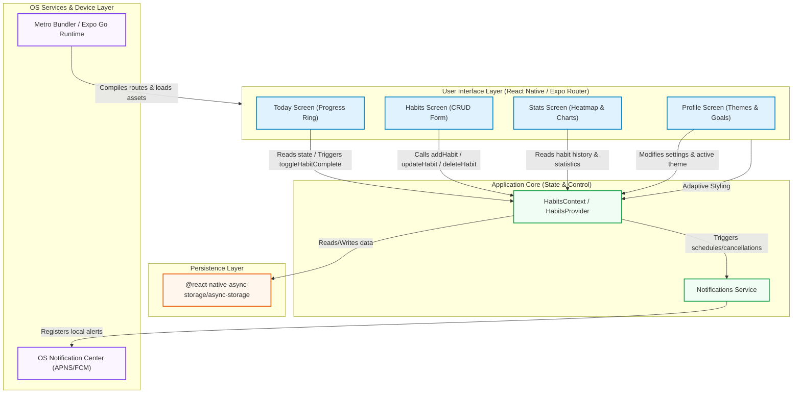

# BiTracker 
> A premium, cross-platform habit tracking application built with React Native, Expo, and TypeScript.

BiTracker is a visual-first mobile habit tracker designed to help users build consistency and track momentum over time. The app runs natively on **iOS**, **Android**, and the **Web** using a single codebase, featuring custom high-fidelity visual widgets, a dynamic dark-mode system, persistence storage, and local reminders.

---

##  System Architecture

The diagram below illustrates the architectural layers, data flows, and subsystem integrations of the BiTracker application:



---

## Key Features

### 1. Today Dashboard (`Today` Tab)
- **Dynamic Headers**: Greets the user based on the local time of day and shows today's formatted date.
- **Circular Completion Gauge**: A custom SVG completion circle showing the percentage of today's completed habits.
- **Actionable List**: Interactive checks to complete habits directly. Tapping on a habit opens a bottom sheet/modal to increment progress (e.g. logging water glasses, workout minutes, or page counts).

### 2. Habits Customizer (`Habits` Tab)
- **Habit Catalog**: View all active habits, showing frequency schedules, configured reminder times, and streaks.
- **Sophisticated Creation Form**: Create habits with custom:
  - Names and unit types (e.g. `glasses`, `min`, `hour`).
  - Target milestones (e.g. `8` units, `45` units).
  - Emoji icons and premium color highlights.
  - Frequency schedules: **Daily**, **Weekdays (Mon-Fri)**, or **Custom days** (with multi-select calendar grids).
  - Reminder alerts time.
- **Manage Routines**: Seamless edit and inline delete capabilities.

### 3. Analytics & Consistencies Dashboard (`Stats` Tab)
- **Key Metrics**: Dynamic calculations of overall Completion Rate, Current Streak, Total Completions this month, and your mathematically calculated "Best Day of the Week" (with percentage consistency).
- **Weekly Progress Chart**: A responsive bar chart showing completion percentages over the last 7 calendar days.
- **Monthly Heatmap Grid**: A GitHub-style calendar consistency grid for the current month showing completion intensity in shades of emerald (light green to dark green), displaying completed vs. missed days at a glance.
- **Habit Breakdowns**: Individual performance listings displaying exact completion rates and color-coordinated horizontal progress bars.

### 4. Settings & Account Profile (`Profile` Tab)
- **Edit Bio**: Update username and customize avatar photo URL.
- **Targets Adjustment**: Change daily completion target and weekly objectives.
- **Notifications Hub**: Toggle Reminders, Daily summaries, and Streak alerts.
- **Global Theme Engine**: Swap between **Light Mode**, **Dark Mode**, or **System Default** themes. Updates the UI styling globally and instantly.

---

##  Technology Stack

- **Framework**: [Expo](https://expo.dev) (v55) & [React Native Router](https://docs.expo.dev/router/introduction) (file-based navigation).
- **Language**: [TypeScript](https://www.typescriptlang.org/) for robust, type-safe development.
- **State Management**: React Context API (`src/context/habits-context.tsx`) with AsyncStorage persistence.
- **Visuals & Charts**: [React Native SVG](https://github.com/react-native-svg/react-native-svg) for charts, heatmaps, and progress wheels.
- **Alerts & Reminders**: [Expo Notifications](https://docs.expo.dev/versions/latest/sdk/notifications/) for scheduling local daily habit alerts.
- **Animations**: [React Native Reanimated](https://docs.expo.dev/versions/latest/sdk/reanimated/) for transitions.

---

##  Directory Structure

```text
bitracker/
├── assets/                 # App icons, splash screens, and bottom tab PNGs
├── scripts/                # Utility scripts (e.g., tab icon copying script)
└── src/
    ├── app/                # Route screens (Today, Habits, Stats, Profile)
    │   ├── _layout.tsx     # Global layout (HabitsProvider & ThemeProvider wrapper)
    │   ├── index.tsx       # Today dashboard tab
    │   ├── habits.tsx      # Habits management tab
    │   ├── stats.tsx       # Analytics & heatmap tab
    │   └── profile.tsx     # Profile & settings tab
    ├── components/         # Custom UI elements (themed view/text, tab buttons)
    │   ├── app-tabs.tsx     # Native bottom tab bar configuration
    │   └── app-tabs.web.tsx # Web-responsive tab bar configuration
    ├── constants/          # Application design tokens (colors, spacings, dimensions)
    ├── hooks/              # Custom React hooks (theme and schemes)
    └── services/           # Service layer
        └── notifications.ts # Local Expo Notifications manager (iOS, Android)
```

---

##  Getting Started

Follow these steps to run the application locally on your computer.

### 1. Install Dependencies
Clone the repository, open a terminal in the root folder, and run:
```bash
npm install
```

### 2. Start the Development Server
Launch the Expo CLI server:
```bash
npx expo start
```

### 3. Open on Your Target Platform
Inside the terminal running the Expo CLI, press the key matching your target test environment:
- Press **`w`** to open in your web browser.
- Press **`a`** to load on an Android Emulator (requires Android Studio).
- Press **`i`** to load on an iOS Simulator (requires macOS and Xcode).
- Scan the QR code in the terminal using the **Expo Go** app on your physical mobile device.

---

##  Verification & Code Quality

The codebase enforces strict type safety and code quality standards.

### Type Check
Run the TypeScript compiler to scan for typing errors:
```bash
npx tsc --noEmit
```

### Linting Check
Verify that the code adheres to style guidelines:
```bash
npm run lint
```
