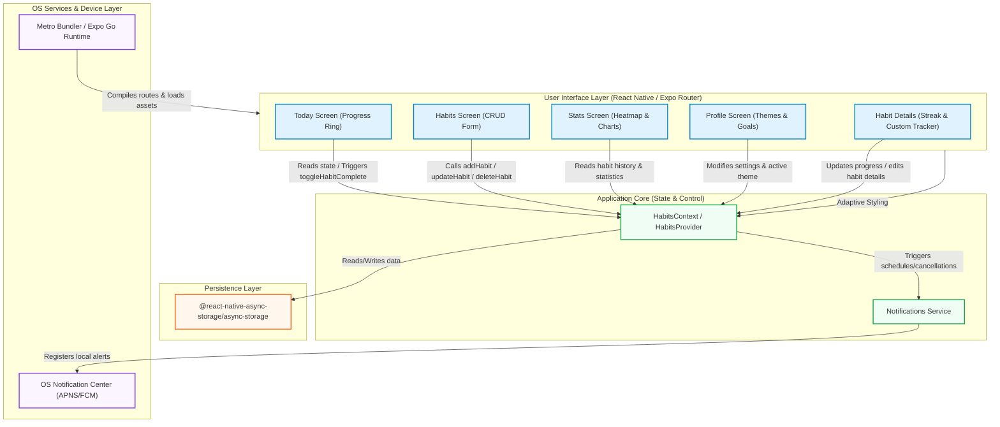

# 🚀 BiTracker

[](https://expo.dev)
[](https://reactnative.dev)
[](https://www.typescriptlang.org/)
[](https://expo.dev)
[](LICENSE)

> A premium, visual-first, cross-platform habit tracking application built with **React Native**, **Expo SDK 55**, and **TypeScript**.

BiTracker is a high-fidelity habit tracking platform designed to help users build consistency and track daily momentum. Running natively on **iOS**, **Android**, and the **Web** from a single codebase, BiTracker incorporates smooth UI micro-animations, customizable schedules, detailed metrics with monthly GitHub-style heatmaps, dark/light theme switching, and local notifications.

---

## 🗺️ Table of Contents
1. [System Architecture](#-system-architecture)
2. [Key Features](#-key-features)
3. [Technology Stack](#-technology-stack)
4. [Data Models & Types](#-data-models--types)
5. [Directory Structure](#-directory-structure)
6. [Getting Started](#-getting-started)
7. [Code Quality & Linting](#-code-quality--linting)
8. [Troubleshooting & FAQs](#-troubleshooting--faqs)

---

## 🏗️ System Architecture

BiTracker follows a modular layered architecture. The diagram below illustrates the relationships between the UI components, context providers, persistence layer, and system-level device APIs:



---

## ✨ Key Features

### 📅 1. Today Dashboard (`index.tsx`)
*   **Time-Adaptive Greetings**: Displays personalized headings based on local hour (e.g., Morning, Afternoon, Evening).
*   **Circular Progress Ring**: A high-fidelity SVG completion circle showing total percentage of daily achievements.
*   **Incremental Progress Tracker**: Tap habits to access a bottom modal/sheet where you can log specific values (e.g., cups of water, gym minutes, pages read) rather than simple binary completion.

### 📝 2. Habits Customizer (`habits.tsx`)
*   **Habit Builder**: Setup new habits with custom emoji icons, custom theme colors, progress targets, and measurement units.
*   **Advanced Scheduling**: Choose between:
    *   **Daily**: Track every day.
    *   **Weekdays**: Automatically schedule for Monday through Friday.
    *   **Custom**: Multi-select weekly grids (e.g. Mon, Wed, Fri only).
*   **Notification Integration**: Set custom time-of-day reminders when creating or editing a habit.

### 📊 3. Analytics & GitHub-Style Heatmap (`stats.tsx`)
*   **Streak Tracking**: Real-time evaluation of active streaks and historically longest completion streaks.
*   **Consistency Heatmap**: A GitHub-style calendar consistency grid for the current month showing completion intensity in shades of emerald (light green to dark green), displaying completed vs. missed days at a glance.
*   **Weekly Charts**: A responsive weekly progress chart showing completion percentages over the last 7 calendar days.
*   **Individual Performance Metrics**: Breakdown of every habit with progress bar gauges and completion ratios.

### ⚙️ 4. Profile & Theming (`profile.tsx`)
*   **Custom Bio**: Set and store profile display names and avatar images.
*   **Global Theme Engine**: Instant transitions between **Light**, **Dark**, or **System Default** themes using CSS Custom Variables.
*   **Goal Adjustments**: Change daily completion target and weekly objectives.

---

## 🛠️ Technology Stack

*   **Core Framework**: [Expo SDK 55](https://expo.dev) & [React Native 0.83.6](https://reactnative.dev)
*   **Router**: [Expo Router v55](https://docs.expo.dev/router/introduction) (File-based routing)
*   **State Management**: React Context API (`src/context/habits-context.tsx`)
*   **Storage**: `@react-native-async-storage/async-storage`
*   **Local Notifications**: `expo-notifications` (handles background scheduling for weekdays/custom calendars)
*   **Visual Elements**: `react-native-svg` (for rendering streak trackers, heatmaps, and progress widgets)
*   **Responsive Styling**: CSS variables and responsive tab-bar configurations (`app-tabs.web.tsx`, `animated-icon.web.tsx`)

---

## 🗄️ Data Models & Types

State is managed by `HabitsContext`. Below is the TypeScript type interface model for a `Habit` and `UserSettings`:

```typescript
export interface HabitProgress {
  progress: number;
  completed: boolean;
}

export interface Habit {
  id: string;
  name: string;
  icon: string; // Emoji character
  color: string; // Hex color code
  frequency: 'daily' | 'weekdays' | number[]; // Array of weekdays 0-6 (Sun-Sat)
  reminderTime: string; // e.g. "09:00 AM"
  progressTarget: number;
  progressUnit: string;
  history: Record<string, HabitProgress>; // Key: YYYY-MM-DD
  scheduledNotificationIds: string[]; // List of scheduled local notification UUIDs
  streakCount: number;
  lastCompletedDate: string | null; // YYYY-MM-DD
  createdAt: string;
}

export interface UserSettings {
  theme: 'light' | 'dark' | 'system';
  units: 'metric' | 'imperial';
  language: string;
  dailyGoalTarget: number;
  weeklyObjective: number;
  notifications: {
    reminders: boolean;
    dailySummary: boolean;
    streakAlerts: boolean;
  };
  profile: {
    name: string;
    avatar: string;
    memberSince: string;
  };
}
```

---

## 📁 Directory Structure

```text
bitracker/
├── assets/                 # App assets, static icons, and tab graphics
├── scripts/                # Build and setup utility scripts
└── src/
    ├── app/                # Route endpoints (Expo Router)
    │   ├── _layout.tsx     # Application entry-point, providers and splash handler
    │   ├── index.tsx       # Today's habit checklist & progress ring
    │   ├── habits.tsx      # Habit catalog & habit creation wizard
    │   ├── stats.tsx       # Heatmaps, statistics, and monthly progress logs
    │   ├── profile.tsx     # Account settings, custom target configurations & themes
    │   └── habit/
    │       └── [id].tsx    # Habit details, editing dashboard, and calendar metrics
    ├── components/         # Common/Shared components
    │   ├── ui/             # Reusable UI atom components (collapsibles, etc.)
    │   ├── animated-icon.tsx# Splash-screen animation handlers (mobile)
    │   ├── animated-icon.web.tsx# Web fallback splash animation
    │   ├── app-tabs.tsx    # Mobile tab layout configs
    │   ├── app-tabs.web.tsx# Web tab layout configs (wider aspect screens)
    │   ├── themed-text.tsx # Colors-adapted typography
    │   └── themed-view.tsx # Colors-adapted container
    ├── constants/
    │   └── theme.ts        # Common color palettes, sizes, fonts, spacing tokens
    ├── context/
    │   └── habits-context.tsx # Core HabitsProvider, Async storage integrations
    ├── hooks/
    │   ├── use-theme.ts    # React Hook wrapper for active light/dark state
    │   └── use-color-scheme.ts # OS color mode listeners
    └── services/
        └── notifications.ts# Local Expo notification permissions & triggers mapper
```

---

## 🚀 Getting Started

Follow these instructions to configure and run the project locally on your machine.

### Prerequisites
*   Node.js (LTS version recommended)
*   npm or yarn
*   (Optional) Expo Go app installed on your physical iOS/Android device

### 1. Install Dependencies
```bash
npm install
```

### 2. Launch Development Server
```bash
npx expo start
```

### 3. Open App on Target Platform
Inside the terminal running Metro, select your target platform by pressing:
*   `w` - to run on the Web Browser.
*   `a` - to run on an Android Emulator.
*   `i` - to run on an iOS Simulator.
*   **QR Code**: Scan the displayed terminal QR code using your phone's camera (iOS) or the Expo Go application (Android) to test on a physical mobile device.

---

## 🛡️ Code Quality & Linting

We maintain code standard checks using ESLint and TypeScript compilation checks:

### Run TypeScript Verification
```bash
npx tsc --noEmit
```

### Run ESLint Checks
```bash
npm run lint
```

---

## 🔍 Troubleshooting & FAQs

### Q: Why aren't push/local notification alerts popping up?
1. **Web Environment**: Local push notifications are not supported on the web platform.
2. **Permissions**: Make sure notifications permissions are enabled on your device. Upon launch, BiTracker requests permissions, which can be re-toggled in the Profile settings.
3. **Simulators**: Android Emulators and iOS Simulators may occasionally block or fail to display local notifications without system configuration tweaks. Test on physical devices via Expo Go for the most reliable results.

### Q: How do I clear all cached habit data?
Since BiTracker uses React Native AsyncStorage, you can clear data by:
*   Resetting/clearing storage inside the Expo Go app.
*   Uninstalling/re-installing the app on physical devices.
*   Clearing your web browser's Local Storage if testing on the Web.

### Q: Issues with styling variables?
BiTracker uses custom CSS variables (like `--font-display`, `--font-rounded`) coupled with custom components like `ThemedView` and `ThemedText` to handle light/dark configurations. Ensure styling conforms to the layouts inside `src/constants/theme.ts`.

---
